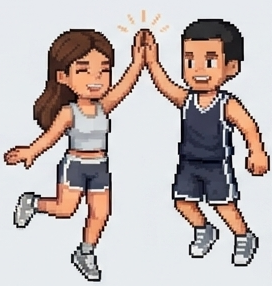
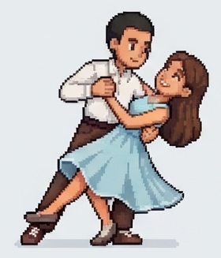

# Together, with love

A small romantic itinerary website for an August 2026 America trip. The page combines a countdown, destination accordion, and playful pixel-character interactions that move toward a meetup moment.

## Preview

<p>
  
  
</p>

## Features

- Responsive single-page itinerary.
- Countdown to August 8, 2026.
- Character meetup widget:
  - boy moves toward girl as the countdown progresses.
  - final couple image appears when the meetup is reached.
  - sleep state follows Berlin and Salt Lake City local times.
  - tap/click triggers small actions.
  - double tap triggers paired love/hug reaction.
- Destination cards for Salt Lake City, Las Vegas, Los Angeles, Bay Area, and return to Salt Lake City.
- Local custom font assets and pixel-art image assets.

## Local Usage

This is a static site. Open `index.html` directly in a browser, or run a local server:

```bash
python3 -m http.server 8000
```

Then open:

```text
http://localhost:8000
```

## Test Helpers

Use query parameters to test widget states:

```text
?progress=0
?progress=0.5
?progress=1
```

Sleep overrides:

```text
?boySleep=1
?girlSleep=1
?boySleep=0&girlSleep=0
```

State overrides:

```text
?boyState=working
?girlState=evening
?boyState=love&girlState=hugReady
```

Special preview:

```text
?love=1&boySleep=0&girlSleep=0
```

## Character States

Main sprite states:

- `idle`
- `blink`
- `yawn`
- `sleep`
- `working`
- `evening`
- `love`
- `hugReady`

Sprite sheet requirements:

- sheet size: `2080 x 1440`
- grid: `4 x 2`
- frame size: `520 x 720`
- transparent background
- consistent alignment across frames

## Project Notes

See [PROJECT_NOTES.md](PROJECT_NOTES.md) for progress notes and future ideas.
